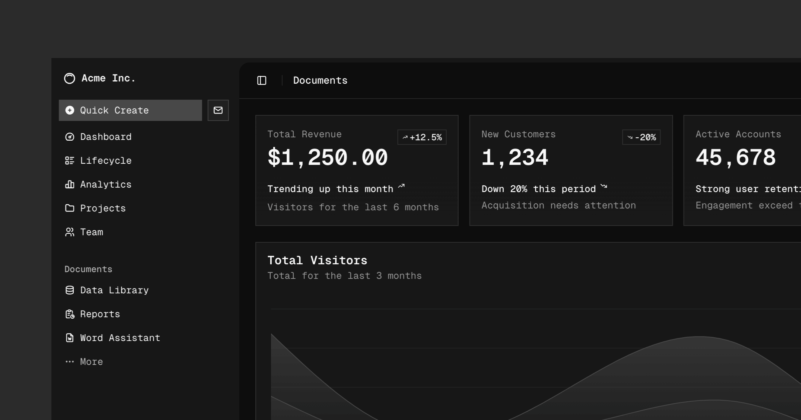

# Reign Labs UI

The foundation of the **Reign Labs ecosystem**. A modern, open-source component library and code distribution platform built with TypeScript, Tailwind CSS v4, and your choice of primitives.

Components are added as source code to your project — no black-box dependencies. You own every line.



## Features

- **57+ components** — Forms, layout, overlays, feedback, data display, and more
- **5 styles** — Vega, Nova, Maia, Lyra, Mira — each with a distinct visual treatment
- **2 primitive bases** — Radix UI or Base UI — pick what fits your project
- **Theming** — OKLCH color system, semantic tokens, light/dark mode, configurable radius and fonts
- **Icon libraries** — Lucide, Tabler, Hugeicons, Phosphor, Remix Icon
- **CLI** — Add components with `npx reignlabs-ui@latest add button card dialog`
- **MCP server** — AI-native component browsing, search, and installation
- **Registry system** — Publish and share your own component registries
- **Templates** — Next.js, Vite, React Router, Astro, TanStack Start, Laravel (+ monorepo variants)
- **RTL support** — Right-to-left layout out of the box

## Quick Start

```bash
# Create a new project
npx reignlabs-ui@latest init --name my-app --preset base-nova

# Or initialize an existing project
npx reignlabs-ui@latest init

# Add components
npx reignlabs-ui@latest add button card dialog sidebar
```

## The Reign Labs Ecosystem

Reign Labs UI is the first building block. The ecosystem will expand to cover everything you need to build modern applications — authentication, payments, analytics, and more — all designed to work together seamlessly.

## Documentation

Visit [ui.reign-labs.com/docs](https://ui.reign-labs.com/docs) to view the full documentation.

## Contributing

Please read the [contributing guide](/CONTRIBUTING.md).

## License

Licensed under the [MIT license](./LICENSE.md).
